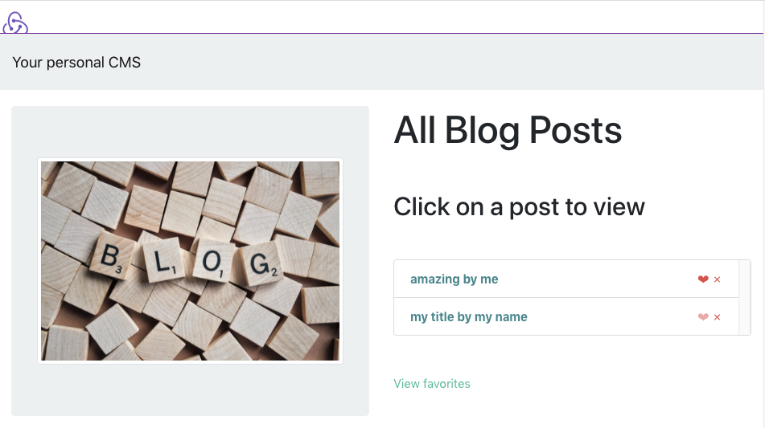

# 📦 Redux-Mongo-Express-CRA
### Template and reference for react-redux
(using create-react-app)

**🌟 (recommended) Out of the box template at**: https://redux-toolkit.js.org/introduction/getting-started

### 👟 Run
1. In root folder using the command line, run <kbd>yarn</kbd>.
2. Run a local or remote MongoDB server (<kbd>mongo</kbd>) (remote env credentials are set up with Heroku & atlassian).
3. In root folder using the command line, run <kbd>yarn seed</kbd> to create some entries and initialize models.
4. <kbd>yarn start</kbd>.
